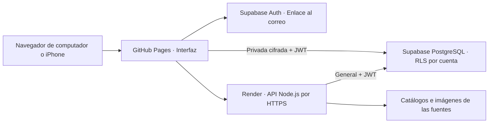

# Lector Manga

Tu biblioteca de mangas y manhwas en el navegador: portadas, varias fuentes,
recomendaciones y un lector pensado para historias verticales y manga paginado.
Puedes usarlo en tu computador con almacenamiento local o publicarlo para
continuar tus lecturas desde el computador y el iPhone con la misma cuenta.

**[Abrir Lector Manga](https://hanyer001.github.io/lector_manga/)** · Para habilitar el registro de usuarios externos, el administrador debe configurar SMTP propio en Supabase. El correo incluido solo admite al equipo del proyecto.

**La aplicación requiere un servidor Node.js para consultar las fuentes.**
GitHub Pages aloja la interfaz; Render ejecuta la API y Supabase gestiona las
cuentas y sus datos. Publicar únicamente el HTML no activa la lectura ni la
sincronización.

## Qué puedes hacer

- Organizar una biblioteca visual con portadas, carpetas, géneros, autores y
  estados personales de lectura.
- Buscar en varios catálogos, añadir series por enlace y actualizar sus capítulos.
- Consultar una vista previa en Explorar y Descubrir sin guardar automáticamente.
  Incluye sinopsis, autoría, géneros y estado cuando la fuente los proporciona.
  Consulta los capítulos y usa **Leer sin guardar** para probarlos. La obra y
  el progreso de esa prueba no se conservan al cerrar; usa **Añadir a biblioteca**
  cuando quieras conservarla y después elige su capítulo guardado para continuar.
- Vincular ediciones de una obra procedentes de distintas fuentes, conservando
  sus capítulos y posiciones de lectura independientes.
- Leer en vertical continuo o en modo paginado, con dirección derecha a izquierda,
  ajuste de ancho, zoom, brillo y filtro cálido. Los controles se ocultan y las
  siguientes 3–5 imágenes se precargan según tu configuración.
- Descubrir historias por gustos, lecturas recientes, similitud, géneros o
  variedad. Puedes elegir fuentes y excluir temas que no quieras leer.
- Cargar más recomendaciones por tandas de 24; se consultan nuevas páginas cuando
  las fuentes admiten paginación.
- Ver por qué se recomienda una obra en su ficha: etiquetas o autoría compartidas
  y filtros coincidentes. Puedes descartarla o ajustar tus filtros desde allí.
- Activar **Solo nuevas** para ocultar fichas ya abiertas, incluso ediciones con
  el mismo título. El historial guarda hasta 1.000 fichas sin valoración, se
  sincroniza con la cuenta y queda en el dispositivo cuando usas el modo invitado.
  **Volver a mostrar las vistas** conserva tus votos y descartes; puedes recuperar
  descartes individualmente en **Mis preferencias y descartes**.
- Buscar otras fuentes desde la ficha o el lector, también si un capítulo falla.
  Las posibles ediciones requieren comprobar título, autor y numeración; no se
  guardan ni vinculan automáticamente. Una prueba en otra edición empieza desde
  el inicio y requiere confirmar la correspondencia del capítulo. Para lecturas
  privadas, utiliza las ediciones vinculadas dentro de su organizador privado.
- Comprobar el capítulo, la imagen y la hora del último guardado confirmado en
  los controles del lector. Los fallos muestran el estado pendiente y permiten
  reintentar. La biblioteca general mantiene una cola local de reintentos; la
  privada conserva las escrituras pendientes en memoria y requiere mantener la
  bóveda abierta hasta confirmar la sincronización.
- Mantener lecturas ocultas en una biblioteca privada, cifrada de extremo a extremo al usar una cuenta.
- Exportar e importar biblioteca, carpetas, capítulos leídos y posición.
- Personalizar temas oscuro, negro OLED, claro o del sistema y el color de acento.

La interfaz nueva utiliza **OLED por defecto**, conserva las preferencias previas
y centraliza los colores en `src/frontend/theme.css`. `--accent-color` controla
el acento. La navegación cambia entre lateral de 224 px e inferior con iconos
en pantallas de hasta 768 px; las tarjetas muestran título y estado sobre la portada.

En el lector, toca el tercio superior o inferior para retroceder/avanzar y la
zona central para mostrar los controles. Deslizar sigue desplazando la página.
Con zoom ampliado o tamaño original, las zonas fijas se retiran para permitir
mover la imagen; siguen disponibles el botón Controles y los atajos de teclado.
Los paneles usan desenfoque suave, desactivable en Apariencia. El área de lectura
en escritorio está centrada y limitada a 800 px.

## Iniciar en tu computador

Requiere **Node.js 22.19 o posterior** y npm. Para despliegues se utiliza Node.js 24.
Abre una terminal dentro de la carpeta del proyecto y ejecuta:

```sh
git clone https://github.com/Hanyer001/lector_manga.git
cd lector_manga
npm ci
npm run server
```

Abre [http://127.0.0.1:3210/](http://127.0.0.1:3210/).
Para detener el servidor, usa `Ctrl+C` en esa terminal.

El modo predeterminado es local y funciona sin cuentas externas. `npm run server`
prepara automáticamente el SDK público y los iconos de la interfaz. `npm start`
ejecuta la herramienta de consola del scraper; para abrir la página utiliza
`npm run server`.

Variables locales opcionales en `.env`, tomando `.env.example` como referencia:

```dotenv
APP_MODE=local
PORT=3210
# DB_PATH=/ruta/a/reader.db
```

El servidor local escucha en `127.0.0.1`: esa dirección pertenece al computador.
Para abrir la biblioteca desde el iPhone, configura el despliegue con HTTPS.

## Cómo se utiliza

La web publicada se puede usar **sin cuenta**. En ese caso, la biblioteca y el
progreso se guardan en IndexedDB, dentro de ese navegador y dispositivo. La
biblioteca privada permanece cifrada con tu contraseña de bóveda. Al borrar los
datos del sitio se pierde esta copia: puedes exportarla desde **Cuenta**.

Iniciar sesión sirve para sincronizar entre dispositivos. Después de acceder,
pulsa **Añadir biblioteca de este dispositivo a mi cuenta** para combinar la
biblioteca de invitado con la cuenta; la copia del dispositivo se conserva.
Las lecturas privadas requieren desbloquear su respaldo durante la importación.

1. En **Biblioteca**, añade el enlace de una serie o busca un título en **Explorar**.
2. Abre su ficha y consulta los capítulos disponibles. **Actualizar capítulos**
   vuelve a consultar la fuente y conserva los estados de lectura.
3. Elige un capítulo. El lector solicita sus imágenes a través del servidor y
   guarda la posición conforme avanzas.
4. Usa **Continuar leyendo** para retomarlo. Organiza las obras con carpetas y
   filtros; marca capítulos como leídos y valora historias para afinar sugerencias.
5. En **Cuenta**, exporta un respaldo o importa una biblioteca anterior. Las
   transferencias privadas solicitan desbloquear la biblioteca y la bloquean al terminar.

La importación combina series por fuente y URL, remapea sus identificadores y
conserva las lecturas existentes. Un respaldo privado contiene títulos y enlaces
ocultos en modo local; con cuenta, su parte privada permanece cifrada. Guárdalo fuera del repositorio. Ni el PIN ni la contraseña se exportan.

## Dónde se guardan los capítulos

Los capítulos se guardan como **enlaces y metadatos**, no como archivos de imágenes.
Las páginas se transmiten desde la fuente a través del proxy de Node.js y se
mantienen temporalmente en memoria del navegador. El lector libera imágenes
lejanas o cerradas y vuelve a solicitarlas cuando se necesitan.

| Información | Modo local | Modo con cuenta |
| --- | --- | --- |
| Series, carpetas, capítulos leídos y posición | `data/reader.db` en SQLite | Estado por usuario en PostgreSQL de Supabase |
| Imágenes de capítulos y portadas | Streaming y memoria temporal | Streaming autorizado y memoria temporal |
| Biblioteca privada | PIN con hash y sal; SQLite no cifrado | Bóveda cifrada antes de sincronizar: títulos, carpetas, capítulos y progreso |
| Tema, acento y ajustes del lector | Navegador | Navegador |

El modo con cuenta admite **12 MiB de metadatos en la biblioteca general y otros 12 MiB en la bóveda privada**. Las imágenes
no ocupan ese espacio. No hay descargas de capítulos para lectura offline: si
la fuente deja de responder o elimina un capítulo, no existe una copia local
completa a la que recurrir.

## Sincronización entre computador e iPhone



Inicia sesión con el mismo correo en ambos dispositivos. Recibirás un enlace de
un solo uso para entrar, sin contraseña. Se sincronizan
la biblioteca, las carpetas, los capítulos leídos y la posición de lectura.
La posición utiliza una imagen y su fracción, para adaptarse a pantallas distintas.

La interfaz consulta cambios aproximadamente cada 15 segundos mientras está
visible y al recuperar visibilidad o conexión. **Sincronizar ahora** permite
actualizarla manualmente. Las escrituras se confirman en PostgreSQL antes de
mostrarse como guardadas. Si otro dispositivo guardó una posición más reciente,
el lector evita reemplazarla y ofrece **Continuar lectura sincronizada**.

El progreso público pendiente puede conservarse en ese navegador para reintentarlo
al recuperar conexión. El privado permanece en memoria: un cambio todavía no
enviado puede perderse al cerrar la página.

En iPhone puedes abrir la URL en Safari o añadirla a la pantalla de inicio desde
Compartir. No necesitas descargar una aplicación de App Store. La caché de la
aplicación web conserva recursos públicos de la interfaz, no capítulos.

El correo de prueba de Supabase solo envía enlaces a miembros del proyecto y
admite inicialmente dos mensajes por hora. Para ofrecer acceso a otros usuarios,
configura SMTP propio siguiendo [la guía de despliegue](DEPLOYMENT.md).

## Biblioteca privada

En la ficha de una obra, **Mover a privada** traslada todas sus ediciones y su progreso fuera de la biblioteca general. Sus datos dejan de participar en las recomendaciones personales.

**Con cuenta, la privada utiliza cifrado de extremo a extremo.** Crea una contraseña de cifrado de al menos 12 caracteres, preferiblemente una frase larga y única. Es independiente del acceso por correo y nunca se envía a Render ni a Supabase. Cada dispositivo debe introducirla para descifrar sus títulos, carpetas, enlaces, capítulos leídos y posición.

El navegador usa Web Crypto: una clave de datos aleatoria de 256 bits, AES-GCM y una clave derivada de la contraseña mediante PBKDF2-SHA-256 con sal aleatoria y 600.000 iteraciones. Supabase conserva únicamente el paquete cifrado de la privada. El navegador lo sincroniza directamente con Supabase usando la sesión del usuario y políticas RLS de propietario; no pasa por Render. La sincronización compara versiones para evitar que un dispositivo reemplace cambios de otro.

Al crear la bóveda se muestra una **clave de recuperación**. Guárdala fuera del navegador: permite desbloquear si olvidas la contraseña. Sin ninguna de las dos no podremos recuperar tus lecturas privadas por correo. Cambiar la contraseña renueva la clave de datos y la recuperación; tendrás que desbloquear los otros dispositivos con la nueva contraseña.

La bóveda cifrada se desbloquea una vez por sesión y permanece abierta al cambiar de sección o capítulo. En **Ajustes → Sesión de la biblioteca privada** puedes elegir el bloqueo tras 5, 15, 30, 60 o 120 minutos sin actividad, y una pausa de 0, 1, 2, 5 o 10 minutos al cambiar de aplicación o pestaña. Los valores iniciales son **30 minutos y 2 minutos**. Se guardan solo los tiempos en este navegador; la clave queda exclusivamente en memoria. Al recargar, cerrar la página, cerrar sesión o pulsar **Bloquear ahora**, debes desbloquear de nuevo. Mientras está en segundo plano se cubre la interfaz; al regresar se comprueban los plazos aunque el teléfono haya suspendido los temporizadores.

Las exportaciones con cuenta mantienen la privada cifrada. Al importar un JSON local antiguo, el navegador cifra la parte privada antes de sincronizarla. Una copia antigua tampoco vuelve a mostrar lecturas ya ocultadas sin desbloquear primero. El modo local por PIN conserva sus límites anteriores: diez minutos sin actividad, una hora de sesión y bloqueo al salir u ocultar la pestaña.

**Límites:** el correo de la cuenta, la existencia y el tamaño de la bóveda siguen siendo visibles para el servicio. Render procesa las URL e imágenes al consultar una portada o leer; este cifrado protege la biblioteca sincronizada, no oculta esas consultas. Tampoco protege un dispositivo infectado ni una versión de la web modificada para robar la contraseña. Los datos que antes fueron públicos pueden haber existido en copias o respaldos previos.

**En modo local**, se conserva el bloqueo por PIN de 4 a 12 dígitos. Ese PIN no cifra `data/reader.db` ni las exportaciones locales; quien tenga acceso al archivo puede leer sus metadatos.

## Fuentes incluidas

Estos son los adaptadores habilitados en el código. Su disponibilidad puede variar
por cambios del sitio, límites de acceso o diferencias entre una conexión local y Render.

| Fuente | Idioma | Buscar y leer | Recomendaciones |
| --- | --- | --- | --- |
| ManhwaWeb | Español | Sí | Sí |
| MangaDex | Español y español latinoamericano | Sí | Sí |
| WEBTOON | Español | Sí | Sí |
| Olympus | Español | Sí | Sí |
| InManga | Español | Sí | — |
| NovelCool | Español | Sí | Sí |
| TuManga.net | Español | Sí | Sí |
| ZonaTMO · zonatmo.org | Español | En el servidor local | Sí, en local |
| SenshiManga · Capibara | Español | Capítulos públicos publicados | Sí |
| Asura Scans | Inglés | Sí | — |
| Tapas | Depende de la obra | Episodios gratuitos sin sesión | — |

TuManga.net es un catálogo diferente de ZonaTMO. SenshiManga usa su catálogo público
paginado, conserva los acentos y omite capítulos restringidos o sin publicar.
ZonaTMO incluye también los capítulos antiguos ocultos inicialmente en su página.
El adaptador funciona localmente, pero **ZonaTMO rechaza las consultas desde Render
con HTTP 403**. Se desactiva en ese alojamiento para no ofrecer una fuente que falla
en la página publicada; SenshiManga sí se verificó desde Render.
Manhwa Latino queda desactivada: respondió HTTP 403 de Cloudflare y el navegador
bloqueó su dominio por seguridad, por lo que no se pudo verificar su lector.
Las fuentes sin
adaptador operativo no aparecen entre las opciones de búsqueda. Consulta
[capacidades y límites por fuente](src/extensions/README.md).

## Cómo recomienda Descubrir

El recomendador combina etiquetas, autores, valoraciones y lecturas recientes;
no utiliza un modelo de inteligencia artificial ni envía tu biblioteca a un LLM.
Los resultados de varias fuentes se intercalan, se deduplican y explican su afinidad.

| Modo | Qué utiliza |
| --- | --- |
| **Para ti** | Gustos, valoraciones y obras con afinidad a tu perfil |
| **Lo que lees** | Las cinco lecturas públicas más recientes |
| **Más como…** | Rasgos relevantes de una obra elegida, sus temas y autores |
| **A tu gusto** | Los géneros, temas y límites que selecciones |
| **Sorpréndeme** | Catálogos generales y rasgos diferentes de tus lecturas |

Compartir solo etiquetas generales como Drama o Acción no basta para recomendar
similitud. Puedes combinar géneros con «cualquiera» o «todos», incluir temas,
excluir etiquetas, elegir fuentes y exigir un mínimo comprobado de capítulos.
Los errores parciales de un catálogo se muestran sin ocultar los demás resultados.
Las lecturas privadas quedan fuera del perfil general.

## Publicar en GitHub Pages + Render + Supabase

Sigue [DEPLOYMENT.md](DEPLOYMENT.md) para crear una instalación propia, aplicar las migraciones,
configurar el acceso por correo, preparar las variables y trasladar una biblioteca local.

- `.github/workflows/pages.yml` publica **solo** `dist/pages` desde la rama `main`.
- `render.yaml` configura la API Node.js y el health check `/api/health`.
- `supabase/migrations/` incluye la creación de tablas, el acceso directo con RLS y la retirada del acceso administrativo antiguo. Sigue su orden de despliegue en `DEPLOYMENT.md`.
- `.env.example` documenta las variables. Pages y Render utilizan la clave publicable y la sesión del usuario; Render no necesita una clave secret/service_role de Supabase. El secreto de tickets de imágenes permanece exclusivamente en Render.
- [SECURITY.md](SECURITY.md) explica el alcance del cifrado, los permisos y la gestión de claves.

La API exige HTTPS en producción, verifica el usuario con Supabase Auth y admite
solo los orígenes de frontend configurados. Las imágenes requieren autorización
y tickets asociados a la cuenta. La comunicación Pages–Render utiliza cabeceras
de autorización y no depende de cookies de terceros.

## Desarrollo y pruebas

| Comando | Uso |
| --- | --- |
| `npm run server` | Servidor y página local |
| `npm test` | Pruebas de API, almacenamiento, recomendaciones y scrapers |
| `npm run test:ui` | Interfaz en Chromium y WebKit con perfil de iPhone |
| `npm run build:pages` | Interfaz estática con configuración pública de despliegue |
| `npm run build:render` | Recursos de cliente y navegador opcional del backend |
| `npm run demo:reader` | Lector aislado con imágenes de prueba, puerto 3211 |
| `npm run demo` | Ejemplo de extracción con fixtures locales |

Para las pruebas de interfaz:

```sh
npx playwright install chromium webkit
npm run test:ui
```

Las pruebas utilizan datos ficticios y bases temporales; no necesitan tus cuentas
ni modifican la biblioteca local. La suite incluye aislamiento entre usuarios,
PIN local, cifrado privado, recuperación, importación, concurrencia y ejecución de las migraciones en PostgreSQL mediante
PGlite. WebKit con perfil móvil ayuda a detectar problemas; la validación final
de inicio de sesión y lectura debe realizarse también en un iPhone real.

## Estructura y extensión

```text
.github/workflows/  Publicación de GitHub Pages y comprobaciones de interfaz
scripts/           Preparación y builds
src/backend/       API, cuentas, privacidad y proxy de imágenes
src/core/          Contratos, operaciones, límites y cancelación
src/extensions/    Adaptadores y registro de fuentes
src/frontend/      Interfaz, recomendaciones y lector
src/storage/       SQLite, importación y estado de biblioteca
src/transports/    HTTP, API JSON y navegador opcional
supabase/          Migraciones de PostgreSQL
test/              Pruebas y fixtures
ui-tests/          Pruebas de navegador
examples/          Demos aisladas
```

Para agregar una fuente, implementa su adaptador y registra identidad, dominios,
capacidades y cargador en `src/extensions/catalog.js`. Cada operación conserva
los límites de red y la validación de URLs del motor.

Documentación técnica: [API](src/backend/README.md),
[almacenamiento](src/storage/README.md), [lector](src/frontend/README.md) y
[transportes](src/transports/README.md).

## Qué se publica en el repositorio

El repositorio contiene código, documentación, fixtures y configuración de ejemplo.
Se excluyen bases de datos, biblioteca personal, exportaciones, imágenes cacheadas,
claves, dependencias, builds, resultados de pruebas y copias de trabajo. Los recursos
generados de la interfaz se preparan al iniciar el servidor o realizar un build.

Mantén tus respaldos y `.env` fuera de Git. La licencia de la tipografía Inter se
conserva en [src/frontend/fonts/LICENSE.txt](src/frontend/fonts/LICENSE.txt).
